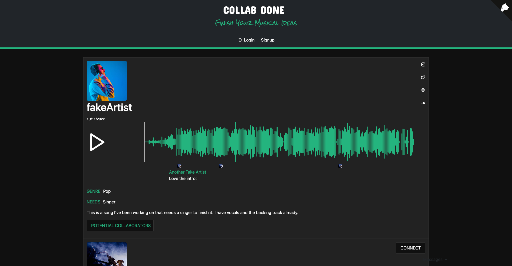
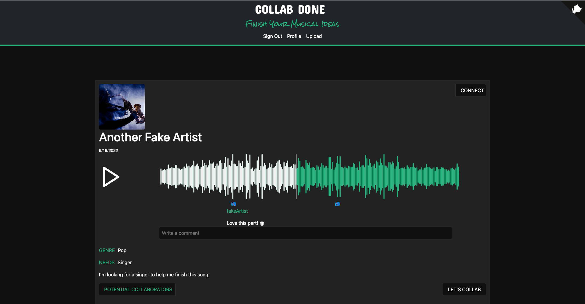
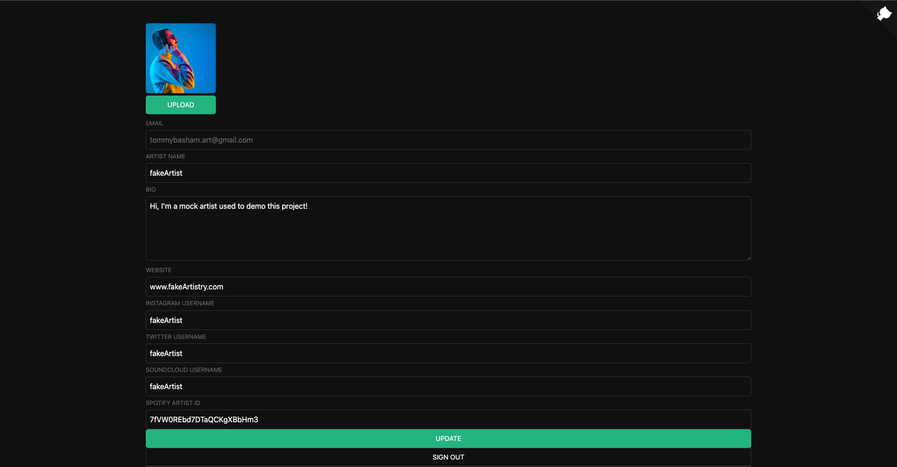
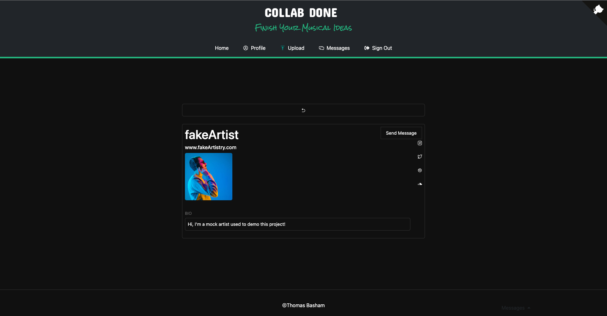
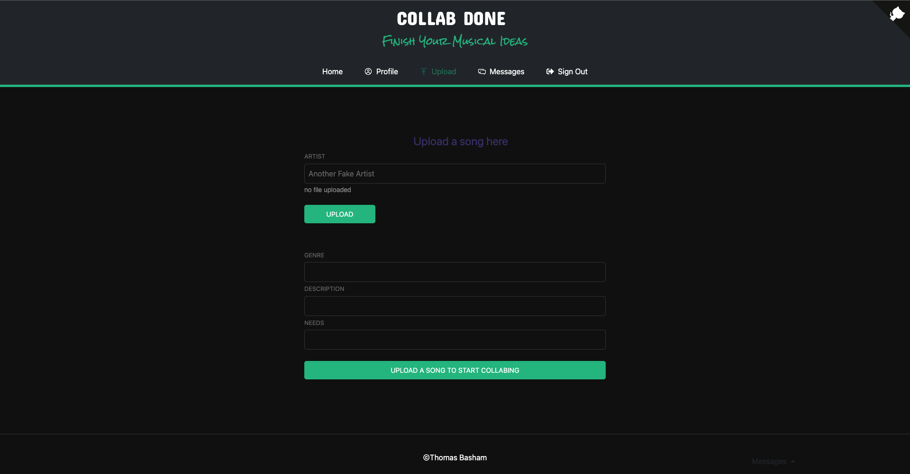
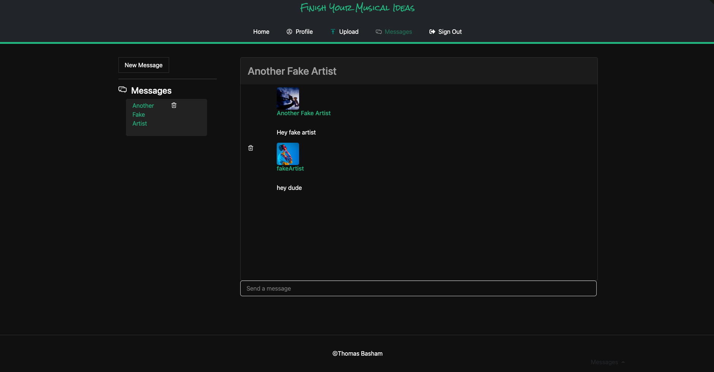

# Collab-done

## Author: Thomas Basham

[https://collab-done.vercel.app/](https://collab-done.vercel.app/)

A social media web application for musicians to connect and collaborate.

## Tech Used

- Reactjs
- Nextjs
- Supabase
- Wavesurferjs
- Bootstrap
- React-Icons
- Vercel

## Features

Users can:

- log in with email authentication and email verification
- log in with Github, Gmail, or Spotify credentials
- Upload an unfinished clip of a song with genre, needs, and description
- View other artist's uploads in the feed sorted by date
- Play, pause, and skip to a section in a song with audio visualization
- Comment on specific spots in a song
- Send direct messages to other users

## References

[supabase.com/docs](https://supabase.com/docs/)

[github.com/supabase/realtime](https://github.com/supabase/realtime)

[creating-new-supabase-users-in-next-js](https://aboutmonica.com/blog/creating-new-supabase-users-in-next-js/)

[supabase-authentication-react](https://ruanmartinelli.com/posts/supabase-authentication-react)

[creating-user-profiles-on-sign-up-in-supabase](https://dev.to/sruhleder/creating-user-profiles-on-sign-up-in-supabase-5037)
