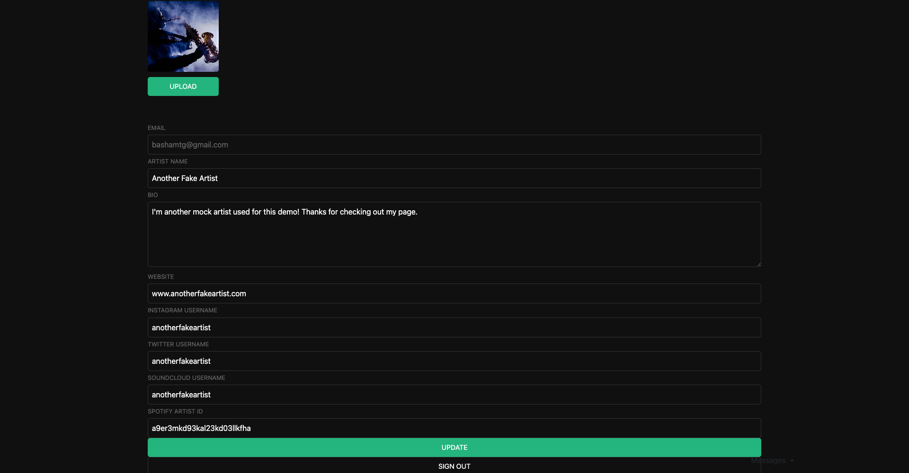

# Collab-done

## Author: Thomas Basham

[https://collab-done.vercel.app/](https://collab-done.vercel.app/)

A full stack web application for musicians to connect and collaborate.

## Tech Used

- Reactjs
- Nextjs
- Supabase
- Wavesurferjs
- Bootstrap
- React-Icons
- Vercel

## References

[supabase.com/docs](https://supabase.com/docs/)

[github.com/supabase/realtime](https://github.com/supabase/realtime)

[creating-new-supabase-users-in-next-js](https://aboutmonica.com/blog/creating-new-supabase-users-in-next-js/)

[supabase-authentication-react](https://ruanmartinelli.com/posts/supabase-authentication-react)

[creating-user-profiles-on-sign-up-in-supabase](https://dev.to/sruhleder/creating-user-profiles-on-sign-up-in-supabase-5037)
